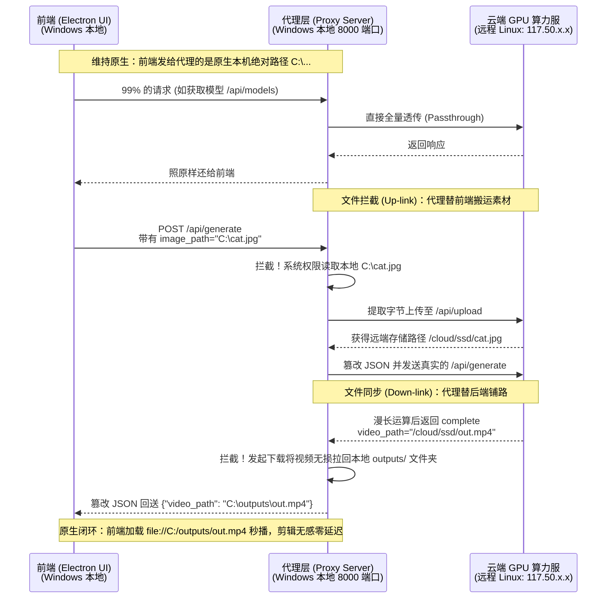

# LTX-Desktop 架构重构白皮书：基于透明代理的环境解耦方案

## 1. 架构调整背景与核心目标 (Background & Objective)
在原版的 LTX-Desktop 架构中，前端 (Electron/React) 深度绑定了本地的 Python 后端。前端默认发送如 `C:\图片\cat.jpg` 这样极具本地特征的绝对路径，后端也直接以该路径读取硬盘并渲染输出，这一切都建立在“**前后端运行在同一台拥有强大 GPU 的 Windows 机器上**”这一假设。

如果我们要实现**在轻薄本（无显卡）上启动客户端，并通过网络连接高性能云端 Linux 节点算力**，直接魔改前端请求（如抽成 Web Blob、拼接流媒体 HTTP 协议）会遭遇严重的生态排异。尤其是诸如 **Timeline Video Editor（高级视频编辑器）** 等核心组件，极其依赖操作系统原生层的高速文件随机访问（即 Electron 能够无感读取 `file://C:/...` 提供极低延迟的预览缓冲），流媒体或伪路径将直接导致组件故障或黑屏卡死。

**终极目标：** 
**零修改前端（Zero Frontend Modification）。** 通过在本地启动一个极致轻巧的“Python透明代理端 (Transparent Proxy)”，伪装成本地全功能后端，承担“环境解耦”、“显卡免检”与“云端双向文件镜像隧道”的全部职责。

---

## 2. 整体架构图谱 (Architecture Blueprint)

---

## 3. 核心功能实现指南 (Implementation Specifications)
此大纲旨在为将来的工程师（或重构 AI）提供步骤与代码向导：

### 3.1 剥离环境检测与实现“秒开”代理 (GPU/Dep Bypass)
**技术路径：**
原项目在启动时，会通过 `backend/ltx2_server.py` 对模型、 `torch`、 CUDA 进行重度加载。为了实现解耦，我们**不能让本地代理加载任何模型代码**。
*   **如何做**：新增或修改为一个新的代理脚本（例如 `backend/proxy_server.py`）。该服务器仅依赖 `fastapi`, `uvicorn` 和 `httpx`。
*   **心跳放行**：本地启动后监听 `127.0.0.1:8000`。任何发往 `/api/health` 的探针请求，代理端瞬间返回 200。这立刻满足了 Electron 中对后端的重构存活检测，让前台客户端的 Loading 画面秒速放行启动。

### 3.2 完全同步的透传隧道 (Transparent HTTP Relay)
*   **技术路径**：利用异步客户端（如 `httpx.AsyncClient`）。
*   除了包含文件引用的核心路由外，诸如 `/api/models`，`/api/settings`，`/api/runtime-policy`，`/api/suggest-gap-prompt`，甚至 `/api/generation/progress` (这决定了进度条展示) 等路由，一律完整接受入参（包括 Headers），透传至目标云端 IP，并将响应按原样反射回 Electron。这保证了无论 LTX 迭代修改了多少参数和设置结构，代理均能免维护支持。

### 3.3 黑客拦截：上行文件劫持 (Up-link Hijack & Upload)
*   **定向拦截范围**： `POST /api/generate`, `POST /api/retake`, `POST /api/ic-lora/generate`。
*   **上传逻辑 (本地到云端)**：
    *   代理在这些请求的 Body (JSON) 中检测如果存在合法的本地 Windows 文件路径（`image_path`, `video_path`，乃至 `retakeVideoPath` 等各种 LTX 的变量名）。
    *   立即调用 Python `open("C:\...", "rb")` 读取该文件。
    *   构建 `multipart/form-data` 以流的形式上传给云端的 `/api/upload`。
    *   得到云端响应的 `Linux 路径`。
    *   将该 `Linux 路径` 替换写入原始的 JSON 载荷中。
    *   放行请求发往云端的生成接口。

### 3.4 黑客拦截：下行文件镜像 (Down-link Hijack & Mirror)
*   **文件落地**： 
    *   一直等待云端生成接口的长连接返回。
    *   代理发现远端下发的 Response 为成功 (`status="complete"` 并且携带 `video_path` 或 `image_urls`)。
    *   代理使用 `GET {云端IP}/api/media?path={远程路径}` 发起极速下载，将其按块写入本地项目同级的 `outputs/` 或约定的项目缓冲目录。
*   **路径“欺诈”**：
    *   文件下载并确保落盘（flush to disk）后，拼接出该本地文件位于本机的绝对路径。
    *   篡改下发的 JSON，将远程 Linux 路径抹去，覆写为此本机 C 盘绝对路径。
    *   返回该最终 JSON 给前端。由于前端只认路不认过程，拿到 `C:\...` 这种原生路径后，会按照最高标准的本地磁盘加载策略交由 Chromium 和 `<video>` 处理。至此，多轨音视频混合、Timeline 时间轴快进将恢复最丝滑的原生体验，彻底终绝“黑屏、断流、超时报错”等网络后遗症。

---

## 4. 重构阶段检查清单 (Refactoring Checklist for AI Agent)
当重构项目时，请务必执行以下核对点：
- [ ] **保证前端绝对原生**：绝不修改 `frontend/` 下用于拦截路径的逻辑。前端甚至不应该出现任何名为 `isExternal` 的判断代码。
- [ ] **本地存储空间准备**：代理服务在启动时，要自动探测并建立 `outputs\` 用于容纳即将要拉回来的巨大媒体资产，并应处理潜在的文件同名覆盖。
- [ ] **异常透传**：如果在请求或拦截上传处理中某一步挂了（比如本地无权读取，云端 API 超时），一定要抓取并转化为兼容 LTX-Error 格式的 `HTTPResponse` 回传前端，确保前端错误弹窗能正常展示报错明细，不要让代理直接宕机或者导致前端死等。
